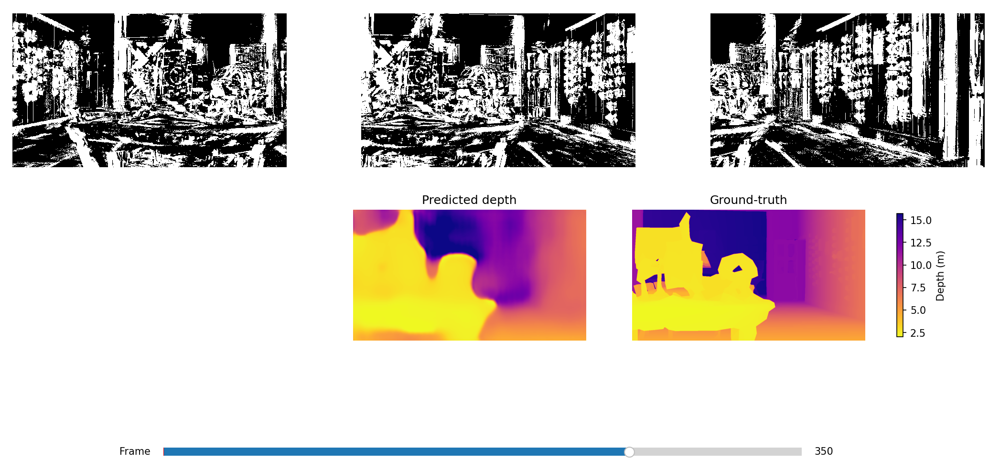

# 03-ModelZoo

Lightweight depth-from-rotation networks for 360° saliency maps built on event-camera or grayscale inputs.

---

## Overview

This folder bundles the reference inference & training code for three **B**inary **E**vent **P**olarity networks (BEP-Net) that estimate dense depth from a monocular rotational parallax. Each variant operates on a different input representation:

| Sub-folder | Channels × Frames | Modality | Short description |
|-----------|------------------|----------|-------------------|
| **bep1c** | 1 × 3 | Event (single polarity) | Accumulated ON events only |
| **bep2c** | 2 × 3 | Event (dual polarity)   | Separate ON / OFF event channels |
| **gray1c**| 1 × 3 | Grayscale               | Standard grayscale frames |

During inference a 3-frame clip is sampled from a 360 ° rotational scan (centre frame ±20 indices → ±15 °). The network regresses depth for the centre view.

---

## Quick-start

```bash
# 1. Clone this repository 
$ git clone https://github.com/xamweil/BEP-Depth-Network.git
$ cd 03-Modelzoo

# 2. Create and activate the conda environment
$ conda env create -f BEP-Net-{Windows/Linux}.yaml
$ conda activate bep-net
```
Grab the demo data (3 .pt tensors: depth_label.pt, input_gray.pt, input_spk.pt).
Download from: **[google Drive](https://drive.google.com/drive/folders/1YzD4SbVfo4sYXybWoIY9DgNdC24BHNbS)**
and drop them into `03-Modelzoo/data/example_scene/`.

```bash
# 3. Run the demo for any model
$ python -m bep1c.demo.demo   # single-polarity event model
$ python -m bep2c.demo.demo   # dual-polarity event model
$ python -m gray1c.demo.demo  # grayscale baseline
```

The demo script loads the pre-trained weights shipped in each `weights/` sub-folder, runs inference on *data/example_scene*, and displays a side-by-side plot of the predicted depth map and ground truth.

---

## Demo preview

<!-- Replace the placeholder below with a screenshot generated by any demo run -->


---


