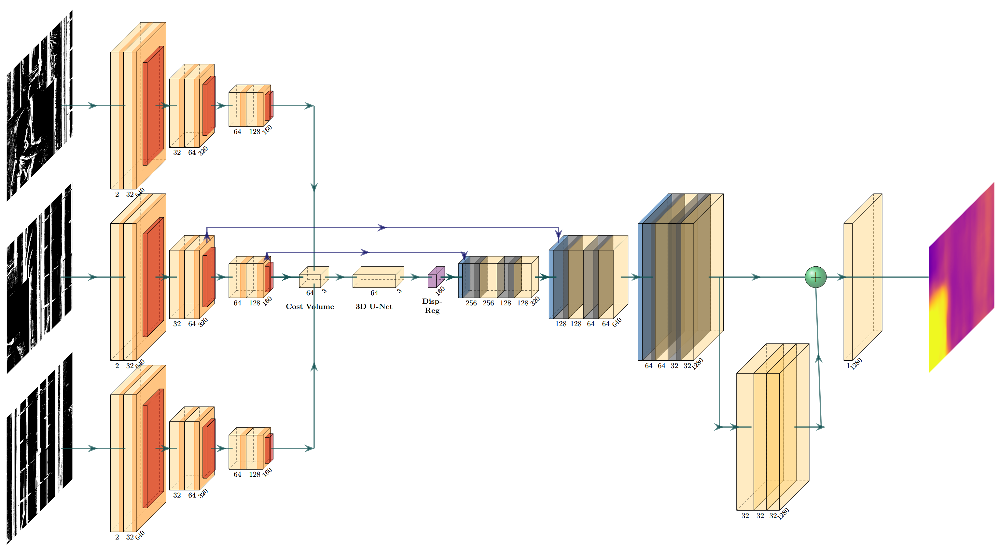

# BEP-Depth-Network

*A compact research toolbox for turning rendered 3-D scenes into event-camera data and training lightweight depth-from-rotation networks.*

---

## Repository layout

| Folder | What’s inside |
| --- | --- |
| **01-ImageConversion** | Converts high-dynamic-range **.exr** renders to 8-bit grayscale **.png** frames. Optional script to visualise event streams as videos. |
| **02-EventSimulation** | Generates polarised event data from the grayscale images via **ESIM**; includes a helper to create timestamp files. |
| **03-ModelZoo** | Three BEP-Net variants (**bep1c, bep2c, gray1c**) + pretrained weights & demo script. |
| **thesis/** (optional) | LaTeX source of the accompanying MSc thesis. |

>  Each module has its own README with detailed usage & environment files.

---

## Model Architecture
